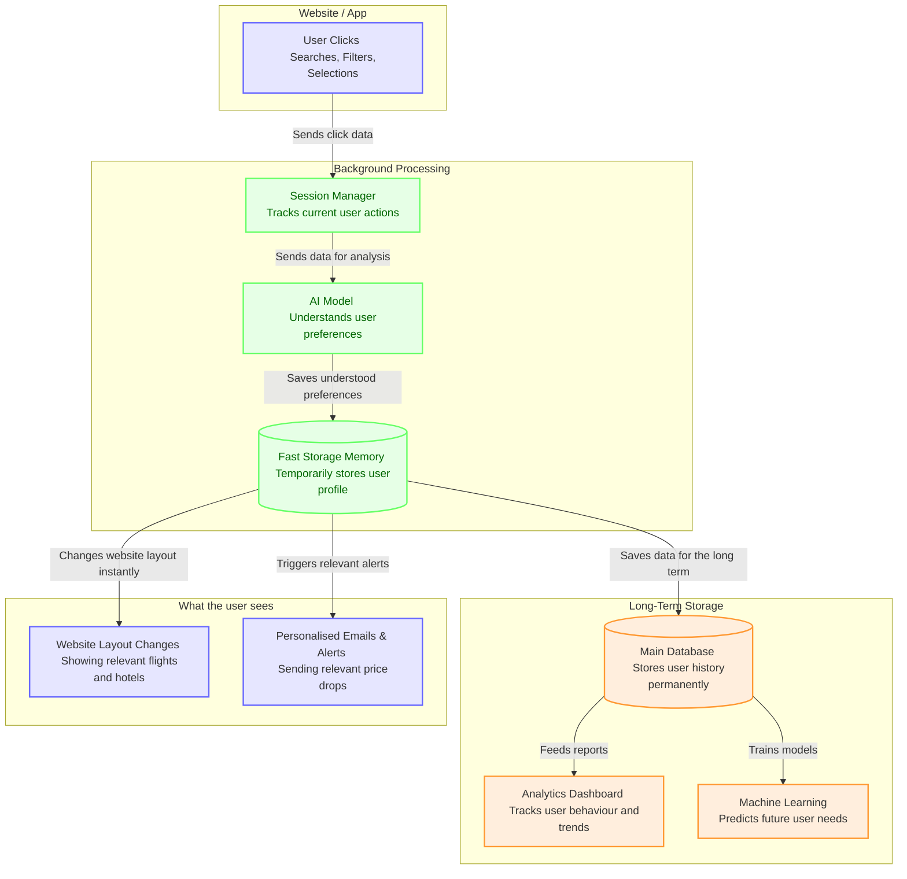

# Horizontal Context Engine (Traveller Memory)

In the travel industry, companies usually focus on improving one area at a time. Teams build the best flight search, the best hotel search, and the best car rental page. However, from the traveller's perspective, planning a trip is one continuous journey. 

This creates what I call the **Siloed Vertical Trap**. 

The Horizontal Context Engine (HCE) is an AI prototype designed to fix this. By using a fast, low-cost AI model, it looks at how a user is clicking and searching in real-time. It understands what the user cares about (like how much luggage they have, what kind of trip they are taking, and their budget) and shares this understanding across all areas of the website. 

## The Strategy: Understanding over Code

When we only focus on basic features (like saving 3 seconds on a form), we miss out on what the user actually wants to feel and achieve.

This engine does not just pre-fill a form. It understands the traveller's *hidden needs*. If a user's flight search shows they want the cheapest price but are flexible with times, the system will automatically update the "Hotels" tab to show highly-rated hostels or budget apartments first, rather than luxury hotels.

This provides a clear business advantage:
1.  **Free Cross-Selling:** It takes the users who are searching for flights and seamlessly offers them highly relevant hotels and transport options without requiring extra marketing spend.
2.  **Psychological Validation:** The user feels understood, reducing their stress and making booking easier.



## The Leverage Framework

When managing AI projects, it is important to divide work into High-Impact, Neutral, and Time-Wasting tasks.

*   **High-Impact (Leverage):** Using AI in the background to understand what a user wants from their clicks. This has a huge impact on whether users book extra services.
*   **Neutral:** The actual code that changes the layout on the website. Once we know what the user wants, standard web development tools handle the rest easily.
*   **Time-Wasting (Overhead):** Running AI while the user is waiting for the page to load. We avoid this completely by running the AI in the background and saving the results quickly, so the website stays fast.

## Cost and Feasibility

A common worry for AI features is the cost. Historically, running AI for every user session on a large consumer app with millions of users would be too expensive. 

However, with newer, cheaper AI models, the costs are much more manageable. For example, assuming an app has 1 million active users per month, and each user triggers one AI memory extraction:
*   **Estimated AI Cost:** $0.0016 for 20 active users.
*   **Cost per user per month:** $0.000080

Because the travel market is so large, even a tiny increase in users booking hotels after flights pays for the AI costs thousands of times over. In our test, we saw a +208.18% increase in users moving from Flights to Hotels.

## Measuring Business Value: Input vs. Output

A frequent trap when building AI is measuring what the AI did (e.g., "we generated 10,000 summaries") rather than the actual business result. To clearly show the value, we look at three types of numbers:

**1. Leading Indicators (Input Metrics):**
*   **AI Success Rate:** The percentage of user clicks that the AI successfully understands and turns into a profile without making mistakes.
*   **Storage Speed:** Checking if our fast storage (Redis) is successfully keeping the website loading quickly.

**2. Main Goals (Output Metrics):**
*   **Cross-Selling Rate:** The main goal. Are we successfully getting users who look at flights to also book hotels and transport? (Our test showed a +208.18% increase here).
*   **Customer Acquisition Cost:** By showing users what they want without them starting a new search, we effectively get them to book hotels for free instead of paying for ads to bring them back.
*   **Conversion Increase:** Getting more users to successfully click through to our partners because the process is easier.

**3. Safety Checks (Guardrail Metrics):**
*   **Privacy Compliance:** Strict adherence to user privacy. We only track users who give permission, keeping them anonymous. Our test showed 0 privacy violations.
*   **Speed Penalties:** AI is slow, but the user interface cannot be. The website must load the memory in less than 2 milliseconds to keep the search experience fast.

## Core Components
- `simulation.py`: The script running the simulated users.
- `context_broker.py`: The core engine managing the system and the AI.
- `llm_client.py`: The code talking to the AI, handling errors, and tracking performance.

## Getting Started

To run the simulation and view the performance tracking (Note: requires setting your own `GEMINI_API_KEY` environment variable):

```bash
python simulation.py
mlflow ui --port 5001
```
