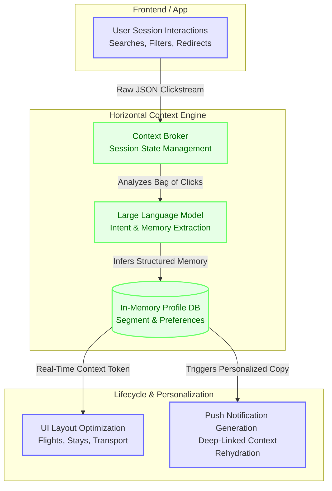

# Skyscanner: Horizontal Context Engine (User Memory)

This project simulates a **Horizontal Context Engine (HCE)** for a multi-vertical travel platform like Skyscanner. The prototype demonstrates how user intent and memory can be extracted from raw interaction logs using **LLM Intent & Memory Extraction** and seamlessly shared across isolated verticals (Flights, Stays, and Transport).

## Architecture: The AI-Native Memory Layer

The system captures unstructured clickstream data, infers long-term user preferences (personas, baggage tolerance, brand loyalty), and leverages that memory to personalize UI layouts and generate real-time, highly targeted Lifecycle Communications (e.g., Price Drop push notifications).



### Core Architecture Components Explained

*   **User Session Interactions:** The raw "bag of clicks" generated by a user navigating the frontend. Instead of rigid funnel tracking, we capture the unstructured reality of how users browse (e.g., opening 5 tabs simultaneously to comparison shop).
*   **Context Broker:** The central orchestration layer. It sits at the edge of the application, intercepting real-time clickstream events and managing the user's active session state. It determines *when* to trigger an LLM extraction (e.g., upon session abandonment).
*   **LLM Intent & Memory Extraction:** The AI reasoning engine. It ingests the raw JSON clickstream and intelligently infers structured long-term memory (e.g., "User is a Solo Backpacker who only travels with carry-on baggage"). 
*   **In-Memory Profile DB:** A fast access layer (simulating Redis) that holds the structured user profile.
*   **UI Layout Optimization & Push Generation:** The downstream consumers of the memory. When the user navigates from Flights to Stays, the UI queries the Context Broker to adapt the hotel search automatically to fit the inferred intent. 

## Validating the Hypothesis & Economics at Scale (100M MAU)

To validate the ROI of this architecture, we ran a programmatic simulation comparing a "Control Group" (legacy siloed experience) against a "Treatment Group" (HCE enabled with personalized layouts and push notifications). 

Based on our simulation of 30 agents over 24 steps:
*   **Simulated Conversion Lift:** +32.41% absolute lift in partner redirects.
*   **Simulated Cross-Vertical Attach Lift:** +100% lift in multi-vertical transitions.
*   **Estimated Cost per MAU:** `$0.000138 USD`

> **VP Product Note - Real-World Testing:** While these lifts are synthetically simulated based on behavioral probability matrices, they serve as the foundational **Success Metrics** for a real-world A/B test. We can deploy this architecture to a 1% live traffic holdout to validate if the actual conversion lift outpaces the AI compute overhead.

### Scaling Projection
Historically, applying Large Language Models to every user session was cost-prohibitive. However, using highly optimized, lightweight LLMs makes "Context Engineering at the edge" viable for enterprise scale. 

If Skyscanner rolled this out to **100 Million Monthly Active Users (MAU)**, the estimated API compute cost to maintain this real-time memory layer would be approximately **$13,800 per month**. 

Given the massive TAM of travel metasearch, even a fraction of the simulated +32% conversion lift would generate revenue that vastly outweighs the $13.8k/month compute expenditure.

## Getting Started
To run the simulation and view the MLflow observability traces:
```bash
python simulation.py
mlflow ui --port 5001
```
