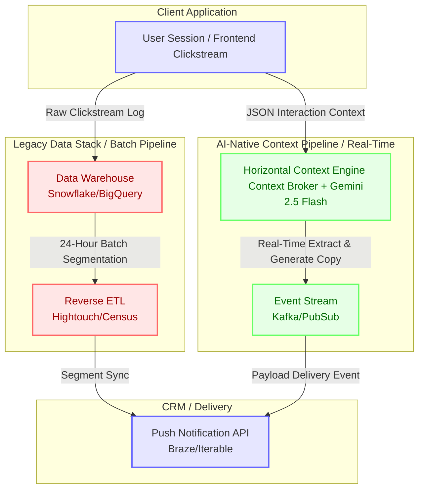

# Traveller Memory (Horizontal Context Engine)

> **"Context is the new UI."**

This project demonstrates the architecture and business value of a **Horizontal Context Engine (HCE)** for multi-vertical travel platforms (like Skyscanner or Expedia). By utilizing **Gemini 2.5 Flash**, the system collapses traditional batch-processed data pipelines into a real-time, AI-native event stream, allowing intent and context to seamlessly persist across Flights, Stays, and Transport.

## Architecture Overview: The AI-Native Data Pipeline



## Product Management Thesis

### 1. The Collapse of the Funnel (Multi-Tab Shopper Edge Case)
Traditional SQL-based funnel analytics (Google Analytics, Mixpanel) rely on linear state machines. They break when travel users open 5 different partner tabs simultaneously to comparison shop. 
By passing the **raw JSON clickstream** directly to an LLM, the Context Engine inherently understands non-linear comparison shopping, inferring user personas without relying on rigid SQL rules.

### 2. The Death of Reverse ETL
Legacy personalization pipelines rely on 24-hour batch processing via Snowflake, dbt, and Reverse ETL tools like Hightouch to push audience lists into a CRM. 
This architecture shifts intelligence to the edge. The HCE segments the user dynamically during the session and fires a real-time event. The CRM (e.g., Braze) becomes a "dumb delivery pipe," simply delivering the exact personalized copy generated by the LLM milliseconds prior.

### 3. Unit Economics at the Edge
Historically, running an LLM on every user session to extract memory was financially impossible. Using highly optimized models like **Gemini 2.5 Flash**, the unit economics completely shift:
*   **Total Tokens Used (30 Agent Simulation):** ~45,000 Input / ~2,500 Output
*   **Estimated Cost per MAU:** `$0.000138 USD`
This makes "Context Engineering at Scale" financially viable for enterprise platforms.

## Core Components
- `simulation.py`: The event orchestrator driving simulated user traffic and logging granular `action_details`.
- `context_broker.py`: The core Horizontal Context Engine acting as a real-time, AI-native CDP.
- `llm_client.py`: The AI gateway handling Gemini 2.5 Flash calls, implementing exponential backoffs, and tracking latency SLA budgets via `mlflow.trace`.

## Getting Started
To run the simulation and view the MLflow observability traces:
```bash
python simulation.py
mlflow ui --port 5001
```
