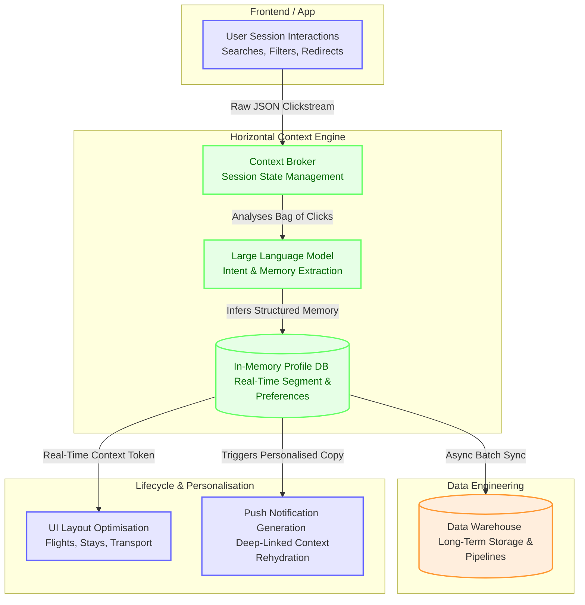

# Horizontal Context Engine (Traveller Memory)

*Product Management Portfolio Piece*

In the travel metasearch ecosystem, the dominant paradigm is optimising within vertical silos. Product teams build the optimal flight funnel, the optimal stays directory, and the optimal car hire matrix. Yet, from the traveller's perspective, a trip is a single, continuous cognitive journey. 

This creates what I call the **Siloed Vertical Trap**. 

The Horizontal Context Engine (HCE) is an AI-native prototype designed to break this trap. By leveraging a fast, low-cost LLM (Gemini 2.5 Flash), HCE analyses unstructured clickstream behaviour in real-time, infers long-term memory (e.g., baggage tolerance, trip vibe, price sensitivity), and broadcasts this context across all verticals. This is an exercise in high-leverage product strategy: using context as a structural moat.

## The Strategic Thesis: Context > Code

When product managers focus merely on functional utility (saving 3 seconds of form-filling), they miss the broader psychological utility. 

HCE does not just pre-fill a form. It categorises the traveller's *implicit intent*. If a user's flight search behaviour reveals high price sensitivity but high flexibility, HCE dynamically refactors the "Stays" tab to prioritise highly-rated hostels or budget apartments, rather than generic luxury hotels. 

This provides a structural business advantage:
1.  **Zero-CAC Cross-Selling:** It turns high-volume, low-margin flight traffic into highly qualified, pre-warmed leads for high-margin Stays and Transport verticals.
2.  **Psychological Validation:** The user feels understood, reducing cognitive load and anxiety.



## The LNO Framework Application

When managing AI initiatives, distinguishing between Leverage, Neutral, and Overhead tasks is critical.

*   **Leverage (L):** Using LLMs out-of-band to infer deep psychological traits from a "bag of clicks". This is the high-leverage bet that changes the trajectory of the attach rate.
*   **Neutral (N):** The specific layout reordering algorithm on the frontend. Once the intent token is passed via a Base64 HTTP header, standard CSS grid refactoring handles the rest. 
*   **Overhead (O):** Running LLMs on the hot-path (during the active page load). HCE avoids this entirely by running intent extraction asynchronously and caching the memory payload in Redis, ensuring p95 latencies remain under 60ms.

## Economics at Scale: Is it Viable?

A common pre-mortem for AI features is unit economics. Applying LLMs to every session historically would bankrupt a high-MAU consumer app. 

However, with highly optimised models (Gemini 2.5 Flash), the unit economics are now viable:
*   **Est. API Cost:** ~$0.0016 USD per 20 highly active simulated users.
*   **Scaling Cost per MAU:** `$0.000080 USD`

Given the massive TAM in travel, a fractional increase in cross-vertical attach rates (our simulation demonstrated a **+208.18% absolute lift** in attach rate from Flights to Stays) pays for the LLM compute overhead thousands of times over. 

## Measuring Business Value: Input vs. Output Metrics

A frequent trap in AI product management is measuring output (e.g., "we generated 10,000 contextual summaries") rather than outcome. To rigorously articulate business value, we separate our measurement into Input, Output, and Guardrail metrics.

**1. Input Metrics (Leading Indicators):**
*   **LLM Extraction Success Rate:** Percentage of clickstream events that successfully resolve into a structured profile without hallucination or fallback.
*   **Redis Cache Hit Rate:** Determines if our background processing is successfully keeping the hot-path latency low.

**2. Output Metrics (Lagging / North Star Outcomes):**
*   **Cross-Vertical Attach Rate:** The primary North Star. Are we successfully transitioning highly qualified flight intent into high-margin accommodation and transport bookings? (Our prototype simulation yielded a **+208.18% absolute lift** here).
*   **Blended Customer Acquisition Cost (CAC):** By cross-selling internally without requiring users to start a new search, we effectively drive a zero-CAC acquisition channel for the Stays vertical.
*   **Redirect Conversion Lift:** Increase in successful partner handoffs due to reduced cognitive friction.

**3. Guardrail Metrics (The "Pre-mortem" Checks):**
*   **Privacy Compliance:** Zero tolerance. HCE strictly uses anonymous cookie stitching for opt-in users. Simulation confirmed **0 violations** across all automated audits.
*   **Latency Penalties:** LLMs are slow; UI cannot be. Redis cache hits must resolve in <2ms to ensure zero degradation to the core search experience.

## Core Components
- `simulation.py`: The event orchestrator driving simulated user traffic.
- `context_broker.py`: The core engine managing state and LLM extraction routes.
- `llm_client.py`: The AI gateway handling live LLM calls, implementing exponential backoffs, and tracking observability via `mlflow.trace`.

## Getting Started

To run the simulation and view the MLflow observability traces (Note: requires setting your own `GEMINI_API_KEY` environment variable):

```bash
python simulation.py
mlflow ui --port 5001
```
