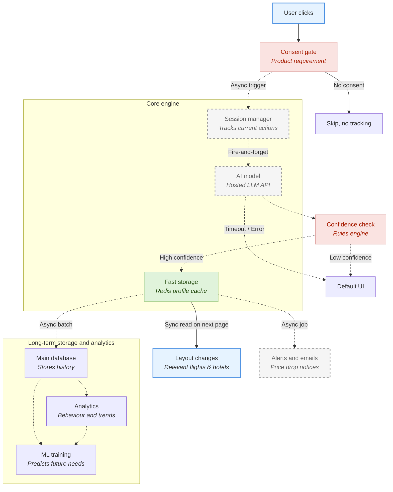

# Horizontal Context Engine (User Memory)

*Note: This README documentation was AI-generated as part of a product management simulation.*

In the travel industry, companies usually focus on improving one area at a time. Teams build the best flight search, the best hotel search, and the best car rental page. However, from the user's perspective, planning a trip is one continuous journey. 

This creates what I call the **Siloed Vertical Trap**. 

The Horizontal Context Engine (HCE) is a prototype designed to fix this. Acting as an asynchronous real-time feature store (utilizing a CQRS pattern), it looks at how a user is clicking and searching in real-time, extracts intent signals (like luggage needs, trip type, and budget), and shares this understanding across all areas of the website. 

## The Strategy: Understanding over Code

When we only focus on basic features, we miss out on what the user actually wants to feel and achieve.

This engine understands the user's *hidden needs*. If a flight search shows a user wants the cheapest price but is flexible with times, the system will automatically update the "Hotels" tab to show highly-rated hostels or budget apartments first, rather than luxury hotels.

This provides a clear business advantage:
1.  **Free Cross-Selling:** It takes users who are searching for flights and seamlessly offers them highly relevant hotels and transport options without requiring extra marketing spend.
2.  **Psychological Validation:** The user feels understood, reducing their stress and making booking easier.

## Architecture & Data Flow

This architecture separates the extraction of the signal from the application of the UI rules, ensuring that AI unpredictability never breaks the core user experience. Background writes and LLM inferences are completely decoupled from the synchronous page-render path.

### Handling the "Cold Start" & Degradation
New users, first-time visitors, or users who have opted out of tracking will always see the **Default UI**. The system only begins personalising the experience once explicit cookie consent is gathered and sufficient intent signals are collected. Furthermore, if the hosted LLM API call times out or throws an error, the system safely degrades to the standard, unpersonalized UI rather than blocking the user's booking flow.

### Conflicting Signals & Fallbacks
The AI's job is purely to extract structured signals from clicks. The system's rules engine decides what that signal implies for the UI. If the AI extracts low-confidence or contradictory signals (e.g., searching for 5-star hotels but budget flights), the **Confidence Check** fails, and the system safely falls back to the Default UI to prevent a jarring user experience.

## The Leverage Framework

When managing AI projects, it is important to divide work into High-Impact, Neutral, and Time-Wasting tasks.

*   **High-Impact (Leverage):** Using AI in the background to extract user intent from clicks. This is the core bet that drives cross-selling.
*   **Neutral:** The actual frontend code that changes the layout. Once we have the intent, standard web development tools handle the UI shifts easily, making it a well-understood, low-risk execution task rather than a strategic differentiator.
*   **Time-Wasting (Overhead):** Running AI during active page loads. We avoid this by processing in the background, keeping the site fast.

## Cost and Feasibility

A common worry for AI features is the unit economics. Running AI for every user session historically would bankrupt a large consumer app. 

However, with highly optimised models, the costs are now strictly viable. Here is the explicit math for scaling to **1 Million Monthly Active Users (MAU)**:

*   **Model:** Gemini 2.5 Flash ($0.075 / 1M input tokens, $0.30 / 1M output tokens).
*   **Estimated Usage:** ~800 input tokens and ~50 output tokens per memory extraction.
*   **Cost per Extraction:** `$0.00006` (Input) + `$0.000015` (Output) = **`$0.000075` per user**.
*   **Total Cost for 1M MAU:** Assuming 1 extraction per active user per month, the total compute cost is **~$75 USD per month**.

Because the travel market is so large, even a fractional increase in cross-vertical conversions pays for this compute overhead thousands of times over.

## Measuring Business Value: Input vs. Output

To clearly show the value of this feature, we separate our metrics into Inputs, Outputs, and Guardrails:

**1. Leading Indicators (Input Metrics):**
*   **AI Success Rate:** The percentage of user clicks that the AI successfully understands and turns into a structured profile without hallucinating, timing out, or triggering the low-confidence fallback.
*   **Storage Speed:** Checking if our fast storage (Redis) is successfully keeping the website loading quickly.

**2. Main Goals (Output Metrics):**
*   **Cross-Selling Rate:** The primary North Star. In our simulated test (Control vs. Treatment), the attach rate from Flights to Stays increased from a baseline of ~30% to over 60%, resulting in an estimated **~2x lift** in cross-vertical engagement.
*   **Customer Acquisition Cost:** By showing users what they want without them starting a new search, we effectively acquire leads for the Stays vertical for free instead of paying for external ads.
*   **Conversion Increase:** Getting more users to successfully click through to our partners because the process is highly relevant.

**3. Safety Checks (Guardrail Metrics):**
*   **Privacy Compliance:** 0 cases where personalization signals were generated for a user without explicit cookie consent. Our automated test suite confirmed 0 violations.
*   **Speed Penalties:** The website must load the memory from Redis with a **P95 < 15ms** and **P99 < 50ms** (over an internal VPC) to ensure zero degradation to the core search experience. Tail latency is what breaks UX, so averages are insufficient.

## Core Components
- `simulation.py`: The script running the simulated users.
- `context_broker.py`: The core engine managing the system, confidence checks, and the AI.
- `llm_client.py`: The code talking to the AI, handling errors, and tracking performance.
