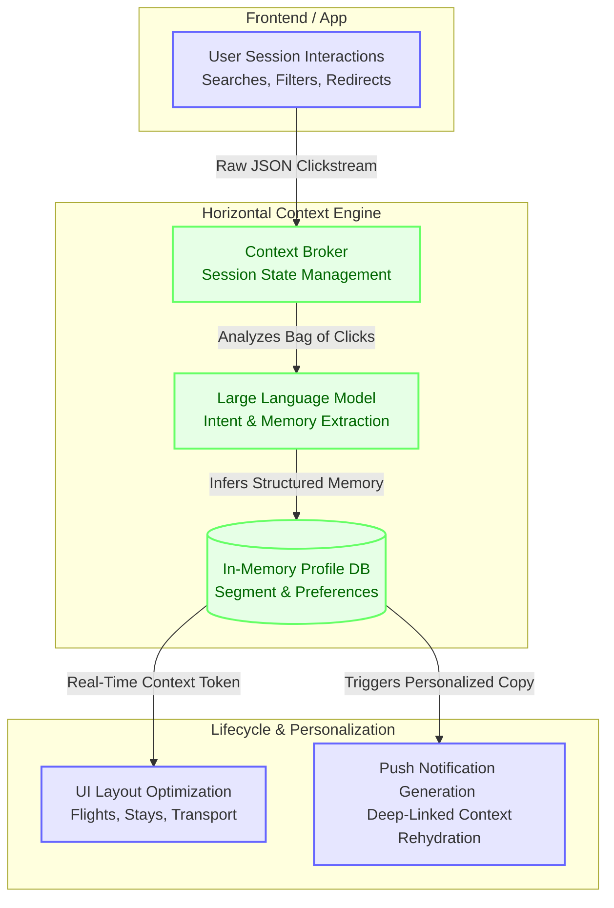

# Product Specification: Skyscanner Horizontal Context Engine ("Traveller Memory")

## Architecture Overview: The AI-Native Memory Layer



## 1. Executive Summary & Product Vision
In traditional metasearch engines like Skyscanner, Flights, Stays (Hotels), and Transport (Car Hire) operate in commercial and technical silos. When a user selects a flight to London and redirects to an airline/OTA to book, navigating back to Skyscanner's Stays tab resets their search context. They are forced to re-enter dates, destinations, and room requirements, resulting in a fractured user experience and a low cross-vertical redirect attachment rate.

The **Horizontal Context Engine (HCE)**, or **Traveller Memory**, resolves this by introducing a centralized, in-memory context layer. By stitching user identity across sessions (using profiles or anonymous consent-based cookie stitching), HCE dynamically refactors UI hierarchies, search filters, and marketing notifications in real-time.

To prove the feasibility of this engine, this prototype runs an **LLM-powered simulation of 30 simulated travelers** over a 24-step search lifecycle. The simulation is powered by a live Gemini LLM integration to demonstrate real-world memory extraction, preference consolidation, and targeted alert copywriting.

---

## 2. Signal Collection: Building the Memory Engine
To construct a reliable traveler memory, HCE collects explicit and implicit signals across Skyscanner's touchpoints:

```
[SEARCH TOUCHPOINTS] ──> (Flights, Stays, Transport)
                             │
     ┌───────────────────────┼───────────────────────┐
     ▼                       ▼                       ▼
[EXPLICIT SIGNALS]      [IMPLICIT SIGNALS]      [EXTERNAL CONTEXT]
 - Origin / Dest         - Navigation Tabs       - Weather (Monsoon)
 - Dates & Pax Counts    - Flight Selection      - Currency Surges
 - Loyalty IDs           - Device Type           - Proximity Anxiety
```

1. **Explicit Signals**: Destination, travel dates, passenger counts, home market, and loyalty inputs (airline alliance preferences, co-branded credit cards).
2. **Implicit Behavioral Signals**: Navigation tabs clicked (detecting cross-vertical intent), flight search scroll-depth, and LCC vs. full-service airline selection.
3. **External Context Signals**: Environmental anomalies injected dynamically (e.g. Monsoon season in India, Currency surges in the US).

---

## 3. Core Architecture
The simulation architecture consists of three core Python classes, integrated with Google's GenAI SDK:

### 3.1 `TravelAgent` (The Simulated User)
Represents a traveler with distinct psychographic and geographic traits.
* **Attributes**:
  * `agent_id`: Unique identifier (e.g., `AGT-0001`).
  * `origin`: Country/City pair (DEL/BOM for India, LON/EDI for UK, NYC/LAX for US).
  * `device`: Mobile App or Desktop Web/mWEB.
  * `login_status`: Logged In (30%) or Anonymous (70%).
  * `consent_opt_in`: Boolean (True/False). If False, HCE personalization is disabled.
  * `ids`: Dict containing `tracking_id`, `ads_id`, and `personalisation_id`.
  * `persona`: 'Value Hacker', 'Loyalty Loyalist', 'Multi-Gen Family Planner', 'Business Bleisure', 'Solo Explorer'.
  * `test_group`: 'Control' (siloed static UI) or 'Treatment' (HCE dynamic UI).
  * `state`: Funnel state (`IDLE`, `SEARCHING_FLIGHTS`, `FLIGHT_REDIRECTED`, `SEARCHING_STAYS`, `STAY_REDIRECTED`, `SEARCHING_TRANSPORT`, `FULLY_REDIRECTED`, `ABANDONED`).

### 3.2 `ContextBroker` (The Central State Store & Caching Topology)
An in-memory store that holds decoupled tokens for each user, manages session/cookie stitching, and routes query/write requests:
* **TIERED STORAGE**:
  * **Session DB**: Stores chronological event logs. Enforces a **7-day TTL** on clickstream data.
  * **Memory DB**: Stores the consolidated structured JSON traveler profiles.
  * **Redis Cache**: Caches compiled 3-layer HCE Tokens (Core Identity, Operational, Intent) in-memory for active searchers with a 30-minute sliding TTL.
    * *Cache Hit*: Sequential searches return token in <2ms.
    * *Cache Miss*: Changing devices or idle steps incurs database query latency (~50ms) to reload, stitch, and cache the token.
* **Stitching Logic**: Anonymous consented users have cookies stitched to a persistent personalisation ID. Opted-out users are blocked from stitching.

### 3.3 `VerticalModules` (Mock UIs)
Functions representing Flights, Stays, and Transport that consume the Base64-decoded token header (`X-Skyscanner-HCE-Token`) and refactor page hierarchies:
* **Flights Layout**: Displays LCC focus for Value Hackers (with upfront baggage alerts); prioritizes alliance carriers for Loyalty Loyalists.
* **Stays Layout**: Pre-fills dates matching the active flight redirect, and centers hotel searches near LHR/BOM.
* **Transport Layout**: Displays large SUVs for Family Planners; displays Heathrow Express transit links for travelers with high airport anxiety.

---

## 4. Live LLM Integration: Memory Lifecycle
The prototype leverages the Gemini API (`gemini-2.0-flash`) for two asynchronous background operations:

### 4.1 Asynchronous Memory Extraction & Consolidation
When a Treatment agent redirects to a flight deal, their session history is sent to Gemini. 
* **The Task**: The LLM parses the raw clicks to extract long-term preferences (e.g. alliance affinities, baggage tolerance) and returns a structured JSON profile update.
* **Drift Resolution**: The LLM consolidates new interactions with existing profiles. If a historically price-sensitive traveler redirects to a business class ticket, the LLM updates their profile, resolving the contradiction.

### 4.2 Localized Price Drop alerts
When a Treatment agent abandons their flight search, HCE triggers a **Price Drop Alert**.
* **The Task**: Gemini generates personalized, copywritten alert text based on the agent's persona, home market, and destination, avoiding generic templates and cashbacks.

*Note: If no `GEMINI_API_KEY` is present in the system environment, the simulation falls back gracefully to standard rule-based mock operations.*

---

## 5. Experimentation Strategy
To launch HCE safely, Skyscanner PMs must leverage a staged experimentation playbook:

```
[EXPERIMENTATION MATRIX]
  │
  ├─> Phase 1: Canary Pilot (1% Traffic) ─> Monitor Latency & Privacy Leaks
  ├─> Phase 2: Staged Scale (10% Traffic) ─> A/B Test Group Segment Analysis
  └─> Phase 3: Global Rollout (50/50) ─> Measure conversion & attach rates
```

1. **Canary Verification (1%)**: Verify that cache hits remain high and the p95 latency stays under 120ms. Confirm that personalization leakage for opted-out users is strictly zero.
2. **Online A/B Test (50/50)**: Compare 15 Control users (static siloed UI) with 15 Treatment users (HCE active).
3. **Experimentation Guardrails & Kill-Switches**:
   * *Latency Guardrail*: If stitching/lookup takes >120ms (p95), HCE rolls back the user to the Control group.
   - *Privacy Guardrail*: If an opted-out user triggers personalization, the HCE system drops their tracking session and triggers a compliance alert.

---

## 6. PM Mindful Items (Personalization Guardrails)
When scaling personalization, PMs must be mindful of several systemic risks:
* **The Creepiness Factor**: Personalizing context for anonymous users must feel natural, not intrusive. We restrict cookie stitching strictly to high-intent signals.
* **Feedback Loops & Echo Chambers**: If the engine only shows LCCs to a "Value Hacker," they will never see full-service carriers, even if prices align. We introduce a **15% exploration factor** to display non-personalized deals.
* **Regulatory Compliance**: GDPR, CCPA, and India's DPDP Act mandate clear Opt-In consents. Personalization must be deactivated if consent is withdrawn.
* **Attribution Sync Latency**: metasearch engines do not own bookings. HCE only optimizes redirect signals; downstream booking data (synced via attribution networks 15 days later) must be used purely for offline model retraining, not in-session memory.

---

## 7. Deliverables & Evaluation Scorecard
The simulation prints a high-level console summary dashboard and exports four deliverables to the local directory:
1. `user_profiles.csv`: Baseline profiles of the 30 travelers.
2. `interaction_logs.csv`: Clickstream events containing the live LLM-extracted memory tokens.
3. `lifecycle_communications.csv`: Traced copy of the Price Drop Alerts (with live LLM-generated text).
4. `ui_mockup_demo.html`: Interactive side-by-side visual simulator.
